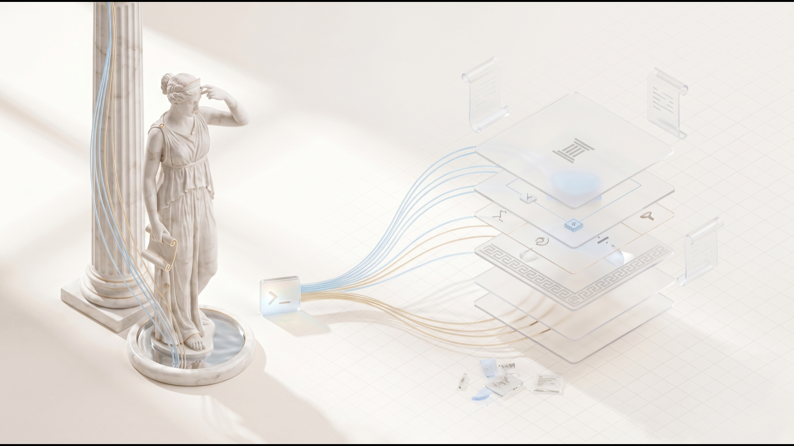

# Mnemazine

Mnemazine превращает скриншоты, PDF, ссылки и записи в готовые заметки, которыми потом реально пользуешься.

[English](README.md) · [中文](README.zh.md)

[](LICENSE) [](https://github.com/zarubinvibe/mnemazine/stargazers) [](https://github.com/zarubinvibe/mnemazine) [](https://github.com/zarubinvibe/athena#olympuz-family)

<p align="center"></p>

<!-- owner-welcome:start -->

> Привет. Я, как и все, сохраняю ссылки и делаю скриншоты, и, как и все, никогда к ним не возвращался. Куча росла, знание нет.
>
> Mnemazine читает эту кучу на моей же машине и оставляет заметки, написанные для меня через полгода. Если она сделает то же для вас, забирайте и делайте своей.
>
> — Филипп Зарубин

<!-- owner-welcome:end -->

## Оглавление

- [Что это](#что-это)
- [Зачем это нужно](#зачем-это-нужно)
- [Главное преимущество](#главное-преимущество)
- [Как это работает](#как-это-работает)
- [Быстрый старт](#быстрый-старт)
- [Простое сравнение](#простое-сравнение)
- [Простые слова](#простые-слова)
- [Безопасность и приватность](#безопасность-и-приватность)
- [Ограничения](#ограничения)
- [Звезда и вклад](#звезда-и-вклад)

<!-- beginner-readme:start -->

## Что это

Mnemazine это локальная фабрика знания. Сырьё кладётся во входящие, а наружу выходят готовые заметки в базе Obsidian. Чтение, распознавание и расшифровка идут на вашем компьютере, и заметка сохраняется только с источником и вердиктом.

## Зачем это нужно

Сохранённые ссылки и скриншоты копятся и остаются непрочитанными. Куча растёт, знание нет. Mnemazine читает эту кучу за вас и оставляет заметки, написанные для вас будущего, с источником и слитыми дублями.

## Главное преимущество

**Главное преимущество:** тяжёлая работа идёт локально, поэтому повторный файл не стоит ничего.

**Почему это лучше:** Распознавание Apple Vision, разбор, расшифровка и хеширование идут на вашей машине. Уже обработанный файл узнаётся по хешу и больше не доходит до платной модели.

## Как это работает

Один прогон проходит весь конвейер. Каждая стадия оставляет доказательство, и прогон не закрывается, пока хоть один файл не учтён.

<!-- workflow-diagram:start -->

```text
  ┌──────────┐   ┌──────────┐   ┌──────────┐
  │ Захват   │ ▶ │ Перепись │ ▶ │ Чтение   │
  └──────────┘   └──────────┘   └──────────┘
        ▼
  ┌──────────┐   ┌──────────┐   ┌──────────┐
  │ Проверка │ ▶ │ Огранка  │ ▶ │ Хранение │
  └──────────┘   └──────────┘   └──────────┘
        ▼
  ┌──────────┐
  │ Возврат  │
  └──────────┘
```

<!-- workflow-diagram:end -->

| Этап | Что происходит |
|---|---|
| 1. Захват | Скриншоты, PDF, ссылки, заметки, аудио, видео |
| 2. Перепись | Перепись по хешам, снимок базы и замок на прогон |
| 3. Чтение | Apple Vision OCR, разбор документов, речь в текст |
| 4. Проверка | Найден первоисточник, факт отделён от догадки |
| 5. Огранка | Длинный материал режется на переиспользуемые атомы |
| 6. Хранение | Разделы, связи, оглавления и ворота полноты |
| 7. Возврат | HTML-сводка, отчёт по знанию и запросы к графу |

### Шаг 1: Положите материал во входящие

Вы кладёте файлы в одну папку или отправляете их своему Telegram-боту. Больше от вас ничего не нужно.

**Что получится:** одни входящие, где лежит всё, что ждёт прочтения.

### Шаг 2: Сторож считает каждый файл

До чтения сторож делает снимок базы, ставит замок на прогон и хеширует каждый входящий файл. Хеш уже в кеше означает, что файл обработан.

**Что получится:** список наземной правды, который следующие стадии не сократят молча.

### Шаг 3: Локальные движки читают материал

Экраны и фотографии идут через Apple Vision, документы разбираются напрямую, аудио и видео расшифровываются локально. Интерфейсный шум и соцсетевая шелуха отбрасываются.

**Что получится:** чистое содержание вместо скриншота, в который пришлось бы вглядываться.

### Шаг 4: Факты получают источник

Материал считается семенем, а не истиной. Стадия ищет первоисточник, проверяет значимые утверждения и помечает то, что подтвердить не удалось.

**Что получится:** заметка, на которую можно ссылаться, с видимым статусом проверки.

### Шаг 5: Одна заметка на одну мысль

Длинный гайд превращается в несколько узких заметок, у каждой понятный заголовок и короткий блок о том, чем она вам поможет. Близкие дубли находятся по смыслу и сливаются, а не копятся.

**Что получится:** заметки такой длины, что будущий запрос тянет только нужную.

### Шаг 6: Заметка ложится в базу

Каждая заметка ложится в свой жизненный раздел, связывается с соседями и попадает в оглавления. Архивировать исходники можно только после того, как учтён каждый входящий файл.

**Что получится:** база Obsidian, по которой можно ходить даже когда она разрослась.

### Шаг 7: Недельная сводка и поиск

Недельная HTML-сводка показывает, что изменилось и на что стоит потратить время. Граф позволяет агенту спросить базу, а не загружать её целиком в контекст.

**Что получится:** знание, которое возвращается к вам само, а не ждёт, пока его вспомнят.

## Быстрый старт

Нужны Node.js 20 или новее, Python 3.11 или новее и Git. Лучше macOS, потому что распознавание Apple Vision есть только там; на Linux работает всё остальное.

```bash
git clone https://github.com/zarubinvibe/mnemazine.git "$HOME/Desktop/Mnemazine"
cd "$HOME/Desktop/Mnemazine"
bash setup.sh
```

`setup.sh` это ведомый путь: он проверяет предпосылки, спрашивает, где будут входящие, и умеет развернуть Telegram-бота. `MNEMAZINE_SETUP_DRYRUN=1 bash setup.sh` показывает план, ничего не трогая, а `bash install.sh` это неинтерактивный скелет, если вы уже знаете, что хотите. Нет Git? Скачайте [ZIP](https://github.com/zarubinvibe/mnemazine/archive/refs/heads/main.zip) или [tar.gz](https://github.com/zarubinvibe/mnemazine/archive/refs/heads/main.tar.gz) и запустите тот же скрипт внутри. Первый раз? Откройте проект в Claude Code и запустите `/mnemazine-setup`: установка пройдёт разговором, по одному вопросу, и ничего не поставится без вашего «да».

Делаете это впервые? [Онбординг](docs/ONBOARDING.ru.md) проводит весь первый запуск по шагам и говорит, что видно после каждой команды.

**Что получится:** папки готовы, локальные движки честно сообщают, что установлено и что работает урезанно, а `vault/` открывается как база Obsidian.

## Простое сравнение

| Вариант | Когда подходит | Что получаете | Минус |
|---|---|---|---|
| **Mnemazine** | Куча сохранённого уже нечитаема | Локальное чтение, проверенные заметки, дедупликация, недельная сводка | Лучший результат требует Mac |
| Складывать файлы в Obsidian руками | Вы сохраняете пару вещей в неделю | Полный контроль и никакой настройки | Никто за вас не читает, не проверяет и не сливает дубли |
| Облачный AI-блокнот | Нужен ответ по загруженным документам | Быстрые вопросы и ответы | Материал уходит с машины, а заметки остаются внутри сервиса |
| Прочитать потом руками | Куча небольшая | Ничего не надо ставить | «Потом» обычно не наступает |

## Простые слова

| Слово | Простое значение |
|---|---|
| Repository | Папка проекта, которую хранит и версионирует Git |
| Terminal | Окно, куда вы вводите команды |
| Command | Одна инструкция компьютеру |
| Branch | Отдельная линия изменений, которая не трогает `main` |
| Pull Request | Просьба проверить ваше изменение и принять его |
| Vault | Папка готовых заметок, которую открывает Obsidian |
| OCR | Превращение картинки с текстом в текст, по которому можно искать |

## Безопасность и приватность

- Локально по умолчанию: распознавание, разбор, расшифровка и хеширование идут на вашей машине.
- Глубокий режим отправляет материал вашему провайдеру модели, только если вы согласились; с выключенным режимом прогон стоит ноль токенов.
- Telegram-бот ваш, а не общий, и без него система работает точно так же.
- Токен бота лежит с закрытыми правами и не попадает в Git.
- Заметки, помеченные как персональные данные, ворота экспорта не выпускают наружу.
- Разбор сайтов и видео трогает только тот адрес, который вы дали сами.

Полная таблица по каналам, с указанием сторожа для каждого, лежит в [полном разборе](docs/DETAILS.ru.md).

## Ограничения

Статус: рабочая локальная система с релизной проверкой и честными кодами возврата.

- Распознавание Apple Vision только на macOS; на Linux скриншоты уходят модели или остаются непрочитанными.
- Проверка находит источники и противоречия, но итоговое суждение остаётся за вами.
- Очень большой первый прогон занимает время, а в глубоком режиме ещё и токены.
- База это обычный Markdown: никакой сервис не держит для вас резервную копию.

Глубже: [полный разбор](docs/DETAILS.ru.md) описывает приём сайтов и видео, контракт качества знания, состав агентов, коды возврата и разбор поломок.

## Звезда и вклад

Пригодилось? Поставьте Mnemazine звезду: [https://github.com/zarubinvibe/mnemazine](https://github.com/zarubinvibe/mnemazine). Это секунда, а от неё зависит, найдут ли проект другие люди.

Хотите что-то поправить? Путь короткий: сделайте fork, заведите ветку, оформите commit, отправьте push и откройте Pull Request. Не отправляйте push прямо в `main`: релизный gate его отклонит.

Нашли ошибку? Заведите issue на [https://github.com/zarubinvibe/mnemazine/issues](https://github.com/zarubinvibe/mnemazine/issues) и напишите, что запускали и что получилось.

<!-- beginner-readme:end -->

<!-- pantheon-family:start -->
## Семья Olympuz

Это один из публичных [проектов семьи Olympuz](https://github.com/zarubinvibe/athena#olympuz-family). Из таблицы можно открыть репозиторий или сразу скачать исходники в ZIP.

| Тип | Название | Что внутри | Скачать |
|---|---|---|---|
| проект | Athena | Переносимая агентная ОС: разворачивает рабочую среду Claude и Codex на новом Mac. | [Репозиторий](https://github.com/zarubinvibe/athena) · [ZIP](https://github.com/zarubinvibe/athena/archive/refs/heads/main.zip) |
| проект | Helioz | Конвейер работы агентов 24/7 с проверяемыми отметками готовности и ночными решениями по цели владельца. | [Репозиторий](https://github.com/zarubinvibe/helioz) · [ZIP](https://github.com/zarubinvibe/helioz/archive/refs/heads/main.zip) |
| проект | Mnemazine | Локальная система памяти: превращает сырьё в проверенные знания для повторного использования. | [Репозиторий](https://github.com/zarubinvibe/mnemazine) · [ZIP](https://github.com/zarubinvibe/mnemazine/archive/refs/heads/main.zip) |
| проект | Themis | Многоагентный помощник по российским судебным делам с локальным OCR и советом из пяти юристов. | [Репозиторий](https://github.com/zarubinvibe/themis) · [ZIP](https://github.com/zarubinvibe/themis/archive/refs/heads/main.zip) |
| проект | Zeuz | Фабрика многоагентных workflow: собирает систему с правилами, гейтами, наблюдаемостью и replay. | [Репозиторий](https://github.com/zarubinvibe/zeuz) · [ZIP](https://github.com/zarubinvibe/zeuz/archive/refs/heads/main.zip) |
<!-- pantheon-family:end -->

## Лицензия

Mnemazine Community License 1.0: бесплатно одному человеку, включая работу на себя. Организации нужно отдельное соглашение. Текст в файле [LICENSE](LICENSE).
