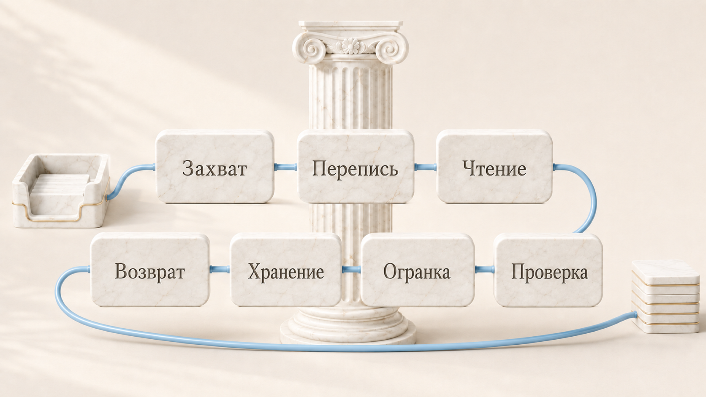

# Mnemazine

Mnemazine читает твою кучу скриншотов и ссылок и оставляет заметки, которыми ты потом пользуешься.

[English](README.md) · [中文](README.zh.md)

[](LICENSE) [](https://github.com/zarubinvibe/mnemazine/stargazers) [](https://github.com/zarubinvibe/mnemazine) [](https://github.com/zarubinvibe/athena#olympuz-family)

<p align="center"></p>

<!-- owner-welcome:start -->

> Привет. Я, как и все, сохраняю ссылки и делаю скриншоты, и, как и все, никогда к ним не возвращался. Куча росла, знание нет.
>
> Mnemazine читает эту кучу на моей же машине и оставляет заметки, написанные для меня через полгода. Если она сделает то же для тебя, забирай и делай своей.
>
> — Филипп Зарубин

<!-- owner-welcome:end -->

## Оглавление

- [Что это](#что-это)
- [Зачем это нужно](#зачем-это-нужно)
- [Главное преимущество](#главное-преимущество)
- [Как это работает](#как-это-работает)
- [Быстрый старт](#быстрый-старт)
- [Простое сравнение](#простое-сравнение)
- [Простые слова](#простые-слова)
- [Безопасность и приватность](#безопасность-и-приватность)
- [Ограничения](#ограничения)
- [Звезда и вклад](#звезда-и-вклад)

<!-- beginner-readme:start -->

## Что это

Mnemazine это фабрика знания. Во входящие ты кладешь что попало: скриншоты, PDF, ссылки, голосовые. Наружу выходят заметки в базе Obsidian. Читает, распознает и расшифровывает твой же компьютер, а в базу заметка попадает только с источником и вердиктом.

## Зачем это нужно

Ссылки копятся, скриншоты копятся, знание нет. Куча растет, читать ее некому, а через полгода ты уже не помнишь, зачем это сохранил. Mnemazine читает эту кучу за тебя и пишет заметку для тебя через полгода: с источником, без дублей, короткую настолько, чтобы ее открыли.

## Главное преимущество

**Главное преимущество:** тяжелое делается локально, поэтому повторный файл не стоит ничего.

**Почему это лучше:** Распознавание, разбор, расшифровка и хеширование идут на твоей машине. Файл, который уже проходил обработку, узнается по хешу и больше не доезжает до платной модели.

## Как это работает

Один прогон проходит весь путь. Каждая стадия оставляет доказательство, и прогон не закрывается, пока хоть один файл не учтен.

<!-- workflow-diagram:start -->

<p align="center"></p>

<!-- workflow-diagram:end -->

| Этап | Что происходит |
|---|---|
| 1. Захват | Скриншоты, PDF, ссылки, заметки, аудио, видео |
| 2. Перепись | Перепись по хешам, снимок базы и замок на прогон |
| 3. Чтение | Apple Vision OCR, разбор документов, речь в текст |
| 4. Проверка | Найден первоисточник, факт отделен от догадки |
| 5. Огранка | Длинный материал режется на переиспользуемые атомы |
| 6. Хранение | Разделы, связи, оглавления и ворота полноты |
| 7. Возврат | HTML-сводка, отчет по знанию и запросы к графу |

### Шаг 1: Положи материал во входящие

Ты кладешь файлы в одну папку или отправляешь их своему Telegram-боту. Больше от тебя ничего не нужно.

<p align="center"></p>

**Что получится:** одни входящие, где лежит все, что ждет прочтения.

### Шаг 2: Сторож считает каждый файл

До чтения сторож делает снимок базы, ставит замок на прогон и хеширует каждый входящий файл. Хеш уже в кеше означает, что файл обработан.

<p align="center"></p>

**Что получится:** список наземной правды, который следующие стадии не сократят молча.

### Шаг 3: Локальные движки читают материал

Экраны и фотографии идут через Apple Vision, документы разбираются напрямую, аудио и видео расшифровываются локально. Интерфейсный шум и соцсетевая шелуха отбрасываются.

<p align="center"></p>

**Что получится:** чистое содержание вместо скриншота, в который пришлось бы вглядываться.

### Шаг 4: Факты получают источник

Материал считается семенем, а не истиной. Стадия ищет первоисточник, проверяет значимые утверждения и помечает то, что подтвердить не удалось.

<p align="center"></p>

**Что получится:** заметка, на которую можно ссылаться, с видимым статусом проверки.

### Шаг 5: Одна заметка на одну мысль

Длинный гайд превращается в несколько узких заметок, у каждой понятный заголовок и короткий блок о том, чем она тебе поможет. Близкие дубли находятся по смыслу и сливаются, а не копятся.

<p align="center"></p>

**Что получится:** заметки такой длины, что будущий запрос тянет только нужную.

### Шаг 6: Заметка ложится в базу

Каждая заметка ложится в свой жизненный раздел, связывается с соседями и попадает в оглавления. Архивировать исходники можно только после того, как учтен каждый входящий файл.

<p align="center"></p>

**Что получится:** база Obsidian, по которой можно ходить даже когда она разрослась.

### Шаг 7: Недельная сводка и поиск

Недельная HTML-сводка показывает, что изменилось и на что стоит потратить время. Граф позволяет агенту спросить базу, а не загружать ее целиком в контекст.

<p align="center"></p>

**Что получится:** знание, которое возвращается к тебе само, а не ждет, пока его вспомнят.

## Быстрый старт

Нужны Node.js 20 или новее, Python 3.11 или новее и git. Лучше Mac: распознавание картинок работает только там. На Linux остальное работает.

```bash
git clone https://github.com/zarubinvibe/mnemazine.git "$HOME/Desktop/Mnemazine"
cd "$HOME/Desktop/Mnemazine"
bash setup.sh          # guided install, asks before it writes anything

# then open it the way you already work:
claude                 # Claude Code
codex                  # Codex CLI
code .                 # an editor, no agent at all
npm run doctor         # plain terminal: is it alive?
```

`setup.sh` это ведомый путь: он проверяет предпосылки, спрашивает, где будут входящие, и умеет развернуть Telegram-бота. `MNEMAZINE_SETUP_DRYRUN=1 bash setup.sh` показывает план, ничего не трогая, а `bash install.sh` это неинтерактивный скелет, если ты уже знаешь, что хочешь. Нет Git? Скачай [ZIP](https://github.com/zarubinvibe/mnemazine/archive/refs/heads/main.zip) или [tar.gz](https://github.com/zarubinvibe/mnemazine/archive/refs/heads/main.tar.gz) и запусти тот же скрипт внутри. Первый раз? Открой проект в Claude Code и запусти `/mnemazine-setup`: установка пройдет разговором, по одному вопросу, и ничего не поставится без твоего «да».

Чтобы попробовать приложение в строке меню macOS после настройки проекта, выполни `npm run app:build`, затем `open .mnemazine/tmp/Mnemazine.app`. Для запуска нужна macOS 14+, для сборки Xcode 26+ с macOS 26 SDK. Рядом с поиском в стиле Spotlight стоят отдельные круглые кнопки ссылок, файлов, буфера и настроек. При переносе файла строка становится зоной приема; обработка начинается только после подтверждения. На macOS 26 используется нативное Liquid Glass, на более ранних версиях системные материалы. Значок приложения изображает граф связанных узлов. Подробнее: [приложение macOS](docs/macos-app.ru.md).

Делаешь это впервые? [Онбординг](docs/ONBOARDING.ru.md) проводит весь первый запуск по шагам и говорит, что видно после каждой команды.

**Что получится:** папки готовы, движки честно говорят, что стоит, а что урезано, и `vault/` открывается как база Obsidian.

## Простое сравнение

| Вариант | Что это | Где идет работа | Читает твои файлы | Что получаешь | Чем платишь |
|---|---|---|---|---|---|
| **Mnemazine** | Локальная фабрика знания | На твоей машине | Да, ради этого и сделано | Проверенные заметки, дедуп, недельная сводка | Лучший результат на Mac, установка занимает несколько минут |
| Obsidian руками | Заметочник, который ты наполняешь сам | На твоей машине | Нет, читаешь ты | Полный контроль над структурой | За тебя никто не читает, не проверяет и не убирает дубли |
| NotebookLM | Облачный блокнот, куда ты загружаешь документы | На серверах Google | Да, после загрузки | Быстрые ответы по загруженному | Материал уходит с твоей машины, заметки остаются в сервисе |
| Notion AI | Рабочее пространство с помощником | На серверах Notion | Да, внутри пространства | Поиск и черновики по твоим страницам | Твой корпус живет внутри чужого продукта |
| Readwise Reader | Читалка отложенного с цитатами | На серверах Readwise | Ссылки и статьи, но не твои папки | Цитаты, которые уезжают в заметки | Он сохраняет и напоминает, но не проверяет |
| Читать потом руками | План, который на деле есть у большинства куч | Нигде | Нет | Ставить нечего | «Потом» почти не наступает |

## Простые слова

| Слово | Простое значение |
|---|---|
| Repository | Папка проекта, которую хранит и версионирует Git |
| Terminal | Окно, куда ты вводишь команды |
| Command | Одна инструкция, которую ты даешь компьютеру |
| Branch | Отдельная линия изменений, которая не трогает `main` |
| Pull Request | Просьба проверить твое изменение и принять его |
| Vault | Папка готовых заметок, которую открывает Obsidian |
| OCR | Превращение картинки с текстом в текст, по которому можно искать |

## Безопасность и приватность

- Локально по умолчанию: распознавание, разбор, расшифровка и хеширование идут на твоей машине.
- Глубокий режим отправляет материал твоему провайдеру модели, только если ты согласился; с выключенным режимом прогон стоит ноль токенов.
- Telegram-бот твой, а не общий, и без него система работает точно так же.
- Токен бота лежит с закрытыми правами и не попадает в Git.
- Заметки, помеченные как персональные данные, ворота экспорта не выпускают наружу.
- Разбор сайтов и видео трогает только тот адрес, который ты дал сам.

Что и куда уходит по каждому каналу и какой сторож это держит, расписано в [полном разборе](docs/DETAILS.ru.md).

## Ограничения

Статус: работает, есть релизная проверка и честные коды возврата.

- Распознавание Apple Vision только на macOS; на Linux скриншоты уходят модели или остаются непрочитанными.
- Проверка находит источники и противоречия, но итоговое суждение остается за тобой.
- Очень большой первый прогон занимает время, а в глубоком режиме еще и токены.
- База это обычный Markdown: никакой сервис не держит для тебя резервную копию.
- Приложение macOS пока собирается из исходников с ad-hoc подписью. Готового нотарифицированного приложения для скачивания и установщика нет. Пути к локальному проекту и Node.js должны оставаться рабочими: самостоятельный backend в сборку не входит.
- В приложение можно вставить URL, включая ссылку YouTube, или название как запрос на исследование. Полный текст страницы и расшифровка видео не гарантируются.
- Встроены CLI-адаптеры Claude Code, Codex и Kimi. После ошибки квоты или частоты запросов замена выбирается только среди допущенных исполнителей; другим CLI нужен адаптер. Обнаружение не подтверждает вход в аккаунт или квоту.

Глубже: [полный разбор](docs/DETAILS.ru.md) про прием сайтов и видео, контракт качества, состав агентов, коды возврата и разбор поломок.

## Звезда и вклад

Пригодилось? Поставь Mnemazine звезду: [https://github.com/zarubinvibe/mnemazine](https://github.com/zarubinvibe/mnemazine). Это секунда, а от нее зависит, найдут ли проект другие люди.

Хочешь что-то поправить? Путь короткий: сделай fork, заведи ветку, оформи commit, отправь push и открой Pull Request. Не отправляй push прямо в `main`.

Нашел ошибку? Заведи issue на [https://github.com/zarubinvibe/mnemazine/issues](https://github.com/zarubinvibe/mnemazine/issues) и напиши, что запускал и что получилось.

<!-- beginner-readme:end -->

<!-- pantheon-family:start -->
## Семья Olympuz

Это один из публичных [проектов семьи Olympuz](https://github.com/zarubinvibe/athena#olympuz-family). Из таблицы можно открыть репозиторий или сразу скачать исходники в ZIP.

| Тип | Название | Что внутри | Чем помогает этому дому | Скачать |
|---|---|---|---|---|
| проект | Athena | Переносимая агентная ОС: разворачивает рабочую среду Claude и Codex на новом Mac. | Разворачивает рабочую среду агента на новой машине: правила, скиллы, хуки — за один прогон. | [Репозиторий](https://github.com/zarubinvibe/athena) · [ZIP](https://github.com/zarubinvibe/athena/archive/refs/heads/main.zip) |
| проект | Helioz | Конвейер работы агентов 24/7 с проверяемыми отметками готовности и ночными решениями по цели владельца. | Гоняет работу агентов круглосуточно и закрывает каждую задачу проверяемой отметкой. | [Репозиторий](https://github.com/zarubinvibe/helioz) · [ZIP](https://github.com/zarubinvibe/helioz/archive/refs/heads/main.zip) |
| проект | Mnemazine | Локальная система памяти: превращает сырье в проверенные знания для повторного использования. | Превращает сырье — скриншоты, PDF, ссылки — в проверенные заметки базы знаний. | [Репозиторий](https://github.com/zarubinvibe/mnemazine) · [ZIP](https://github.com/zarubinvibe/mnemazine/archive/refs/heads/main.zip) |
| проект | Themiz | Многоагентный помощник по российским судебным делам с локальным OCR и советом из пяти юристов. | Ведет российские судебные дела многоагентно, с локальным хранением материалов. | [Репозиторий](https://github.com/zarubinvibe/themiz) · [ZIP](https://github.com/zarubinvibe/themiz/archive/refs/heads/main.zip) |
| проект | Zeuz | Фабрика многоагентных workflow: собирает систему с правилами, гейтами, наблюдаемостью и replay. | Собирает многоагентный workflow с правилами, воротами, наблюдаемостью и повтором прогона. | [Репозиторий](https://github.com/zarubinvibe/zeuz) · [ZIP](https://github.com/zarubinvibe/zeuz/archive/refs/heads/main.zip) |
| проект | Lynceuz | Собирает доказательства из открытого веба за ноль рублей и честно останавливается, когда безопасные пути кончились. | Собирает доказательства из открытого веба бесплатно и честно останавливается на границе. | [Репозиторий](https://github.com/zarubinvibe/lynceuz) · [ZIP](https://github.com/zarubinvibe/lynceuz/archive/refs/heads/main.zip) |
| проект | Iriz | Диктовка в строке меню macOS: речь разбирается на твоем Маке, раскладка чинится сама, надиктовка превращается в готовое задание для агента. | Диктовка в строке меню macOS: речь разбирается на твоем Маке, раскладка чинится сама. | [Репозиторий](https://github.com/zarubinvibe/iriz) · [ZIP](https://github.com/zarubinvibe/iriz/archive/refs/heads/main.zip) |
| проект | Mantoz | Ставит идею перед пятьюстами людьми, которых не существует, и показывает, как ответила каждая группа. | Ставит идею перед сотнями сгенерированных людей до того, как ее увидят живые. | [Репозиторий](https://github.com/zarubinvibe/mantoz) · [ZIP](https://github.com/zarubinvibe/mantoz/archive/refs/heads/main.zip) |
| проект | Koiz | Одна база уроков на все проекты. Каждый провал доводится до причины, и причина висит открытой, пока ее не закроет хук, ворота или тест. | Держит одну базу уроков на все проекты и требует механизм, а не обещание. | [Репозиторий](https://github.com/zarubinvibe/koiz) · [ZIP](https://github.com/zarubinvibe/koiz/archive/refs/heads/main.zip) |
<!-- pantheon-family:end -->

## Лицензия

Mnemazine Community License 1.0: бесплатно одному человеку, включая работу на себя. Организации нужно отдельное соглашение. Текст в файле [LICENSE](LICENSE).
