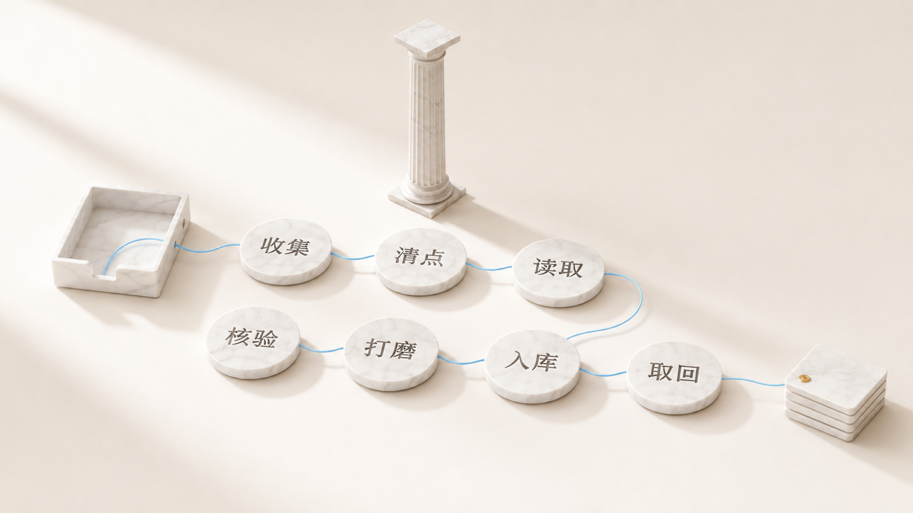
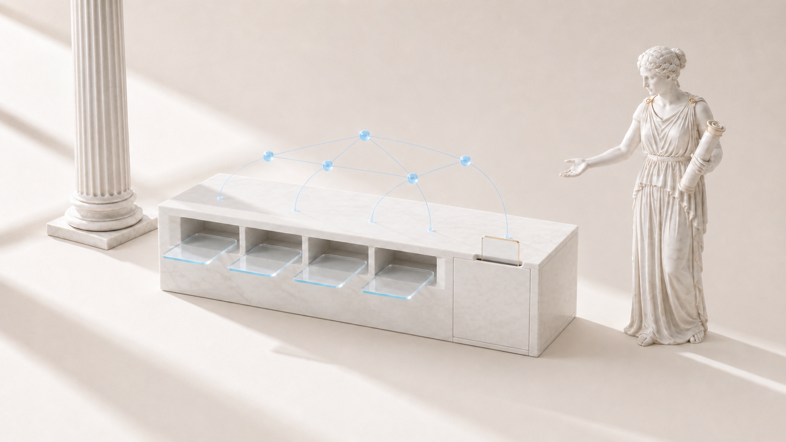

# Mnemazine

Mnemazine 把你堆着的截图和链接读完，留下你以后真会回头看的笔记。

[English](README.md) · [Русский](README.ru.md)

[](LICENSE) [](https://github.com/zarubinvibe/mnemazine/stargazers) [](https://github.com/zarubinvibe/mnemazine) [](https://github.com/zarubinvibe/athena#olympuz-family)

<p align="center"></p>

<!-- owner-welcome:start -->

> 你好。我和所有人一样存链接、截图，也和所有人一样从来没有回头去看。堆越来越大，知识没有变多。
>
> Mnemazine 在我自己的机器上读完这堆东西，留下写给半年后的我的笔记。如果它对你也一样有用，就拿去，把它变成你自己的。
>
> — Filipp Zarubin

<!-- owner-welcome:end -->

## 目录

- [这是什么](#这是什么)
- [它解决什么问题](#它解决什么问题)
- [最大的优势](#最大的优势)
- [工作流程](#工作流程)
- [快速开始](#快速开始)
- [简单对比](#简单对比)
- [简单词汇](#简单词汇)
- [安全与隐私](#安全与隐私)
- [局限](#局限)
- [点亮星标与参与](#点亮星标与参与)

<!-- beginner-readme:start -->

## 这是什么

Mnemazine 是一座知识精炼厂。收件箱里你随便放：截图、PDF、链接、语音。出来的是 Obsidian 里的笔记。读取、识别和转写都由你自己的机器做，一条笔记只有带着来源和结论才进知识库。

## 它解决什么问题

链接越存越多，截图越存越多，知识没有变多。堆着没人读，半年后你连当初为什么存都想不起来。Mnemazine 替你把这堆读完，写给明年的你：有来源，去掉重复，短到你真的会打开。

## 最大的优势

**最大的优势：** 重活在本地做，所以同一个文件再来一次不花钱。

**为什么这样更好：** 识别、解析、转写和哈希都在你的机器上跑。处理过的文件靠哈希认出来，不会再送到付费模型那边。

## 工作流程

一次运行走完整条路。每个阶段都留下证据，只要还有一个文件没交代，这次运行就不结束。

<!-- workflow-diagram:start -->

<p align="center"></p>

<!-- workflow-diagram:end -->

| 阶段 | 会发生什么 |
|---|---|
| 1. 收集 | 截图、PDF、链接、笔记、音频、视频 |
| 2. 清点 | 按哈希清点、给知识库做快照、给这次运行上锁 |
| 3. 读取 | Apple Vision 识别、文档解析、语音转文字 |
| 4. 核验 | 找到第一手来源，把事实和猜测分开 |
| 5. 打磨 | 长材料被切成可复用的知识原子 |
| 6. 入库 | 分区、连接、目录，还有一道覆盖闸门 |
| 7. 取回 | HTML 简报、知识报告和对图谱的查询 |

### 第 1 步：把材料丢进收件箱

你把文件放进一个文件夹，或者发给自己的 Telegram 机器人。除此之外不需要你做别的。

<p align="center"></p>

**你会得到：** 一个收件箱，里面装着所有等着被读的东西。

### 第 2 步：守卫清点每一个文件

在读任何东西之前，守卫先给知识库做快照，给这次运行上锁，并为每个进来的文件算哈希。哈希已经在缓存里，说明这个文件处理过了。

<p align="center"></p>

**你会得到：** 一份地面真相清单，后面的阶段不能悄悄把它变短。

### 第 3 步：本地引擎来读

截图和照片走 Apple Vision，文档直接解析，音频和视频在本地转写。界面噪音和社交平台的壳子会被丢掉。

<p align="center"></p>

**你会得到：** 干净的内容，而不是一张还要眯着眼看的截图。

### 第 4 步：事实要有来源

材料被当作种子，而不是结论。这一步去找第一手来源，核对重要的说法，并标出确认不了的部分。

<p align="center"></p>

**你会得到：** 一条可以被引用的笔记，核验状态一眼可见。

### 第 5 步：一条笔记只讲一件事

一份长指南会变成几条聚焦的笔记，每条都有明白的标题，还有一小段说明它对你有什么用。语义上接近的重复会被合并，而不是继续堆着。

<p align="center"></p>

**你会得到：** 笔记短到以后一次提问只会拉出真正相关的那一条。

### 第 6 步：笔记落进知识库

每条笔记归入自己的生活分区，和相邻的笔记连起来，并进入目录。只有当每个进来的文件都有交代，才允许归档原始材料。

<p align="center"></p>

**你会得到：** 一个越长越大仍然走得通的 Obsidian 知识库。

### 第 7 步：每周简报与检索

每周的 HTML 简报显示有什么变化、什么值得动手。图谱让智能体去查询知识库，而不是把整个库塞进上下文。

<p align="center"></p>

**你会得到：** 知识会主动回到你面前，而不是等你想起来。

## 快速开始

需要 Node.js 20 以上、Python 3.11 以上和 git。最好是 Mac：图片识别只有那里有。在 Linux 上其余照常。

```bash
git clone https://github.com/zarubinvibe/mnemazine.git "$HOME/Desktop/Mnemazine"
cd "$HOME/Desktop/Mnemazine"
bash setup.sh          # guided install, asks before it writes anything

# then open it the way you already work:
claude                 # Claude Code
codex                  # Codex CLI
code .                 # an editor, no agent at all
npm run doctor         # plain terminal: is it alive?
```

`setup.sh` 是带引导的路径：它检查前置条件，问你收件箱放在哪里，还能部署 Telegram 机器人。`MNEMAZINE_SETUP_DRYRUN=1 bash setup.sh` 只看计划，不动任何文件；`bash install.sh` 是非交互的骨架安装，适合你已经清楚要什么的时候。没有 Git？下载 [ZIP](https://github.com/zarubinvibe/mnemazine/archive/refs/heads/main.zip) 或 [tar.gz](https://github.com/zarubinvibe/mnemazine/archive/refs/heads/main.tar.gz)，在里面跑同样的脚本。 第一次用？在 Claude Code 里打开项目并运行 `/mnemazine-setup`：安装以对话方式进行，一次问一个问题，没有你的同意不会装任何东西。

第一次做这件事？[上手引导](docs/ONBOARDING.zh.md) 会一步一步带你走完第一次运行，并写清楚每条命令之后你会看到什么。

**你会得到：** 目录建好，各个引擎老实说明哪些可用、哪些降级，`vault/` 可以直接当 Obsidian 知识库打开。

## 简单对比

| 方案 | 是什么 | 工作在哪里进行 | 读你的文件 | 你会得到 | 代价 |
|---|---|---|---|---|---|
| **Mnemazine** | 本地的知识精炼厂 | 你自己的机器 | 是，这正是它的目的 | 经过核验的笔记、去重、每周简报 | 最佳效果需要 Mac，安装要花几分钟 |
| 手动整理 Obsidian | 由你自己填充的笔记应用 | 你自己的机器 | 不，阅读由你来做 | 对结构的完全掌控 | 没有人替你阅读、核验或去重 |
| NotebookLM | 把文档上传上去的云端笔记本 | Google 的服务器 | 是，上传之后 | 对已上传内容的快速问答 | 材料离开你的机器，笔记留在那个服务里 |
| Notion AI | 带助手的工作空间 | Notion 的服务器 | 是，在工作空间内 | 跨页面的搜索与起草 | 你的资料库住在别人的产品里 |
| Readwise Reader | 带高亮的稍后读应用 | Readwise 的服务器 | 链接和文章，而不是你的文件夹 | 会同步进笔记的高亮 | 它负责保存与再次呈现，不负责核验 |
| 以后再手动读 | 大多数积压其实就是这个计划 | 哪里都不在 | 否 | 没有东西要安装 | 「以后」很少真的到来 |

## 简单词汇

| 词 | 简单解释 |
|---|---|
| Repository | 仓库：Git 保存并记录版本的项目文件夹 |
| Terminal | 终端：你输入命令的窗口 |
| Command | 命令：给电脑的一条指令 |
| Branch | 分支：不影响 `main` 的另一条修改线 |
| Pull Request | 合并请求：请别人审阅并接受你的修改 |
| Vault | 知识库：存放成品笔记的文件夹，用 Obsidian 打开 |
| OCR | 文字识别：把图片里的文字变成可以搜索的文本 |

## 安全与隐私

- 默认本地：识别、解析、转写和哈希都在你的机器上完成。
- 深度模式只有在你同意时才把材料发给你选定的模型服务；关闭时这次运行不花任何 token。
- Telegram 机器人是你自己的，不是共用的，没有它系统照样工作。
- 机器人的令牌以受限权限保存，不会进入 Git。
- 标记为个人数据的笔记会被导出闸门挡下，不会流出去。
- 网站和视频解析只碰你自己给出的那个地址。

每条通道会送出什么、由哪个守卫拦着，都写在[完整参考](docs/DETAILS.md)里。

## 局限

状态：可用，带发布检查和诚实的退出码。

- Apple Vision 识别只在 macOS 上；在 Linux 上截图要么交给模型，要么留着不读。
- 核验能找到来源和矛盾，但最终判断仍然是你的。
- 第一次处理很大的一堆材料会花时间，在深度模式下还会花 token。
- 知识库就是普通的 Markdown：没有哪个服务替你做备份。

想更深：[完整参考](docs/DETAILS.md) 讲网站与视频接入、质量契约、智能体名单、退出码和故障排查。

## 点亮星标与参与

觉得有用？给 Mnemazine 点亮星标：[https://github.com/zarubinvibe/mnemazine](https://github.com/zarubinvibe/mnemazine)。这只要一秒，却决定别人能不能找到这个项目。

想改点什么？流程很短：先 fork 仓库，建一个分支 branch，提交 commit，推送 push，然后开一个 Pull Request。请不要直接向 `main` 推送，发布闸门会拒绝。

发现问题？到 [https://github.com/zarubinvibe/mnemazine/issues](https://github.com/zarubinvibe/mnemazine/issues) 开一个 issue，写清楚你运行了什么、发生了什么。

<!-- beginner-readme:end -->

<!-- pantheon-family:start -->
## Olympuz 家族

这是 [Olympuz 家族](https://github.com/zarubinvibe/athena#olympuz-family) 的公开项目之一。表格里的每一行都可以打开仓库，或者直接下载源码压缩包。

| 类型 | 名称 | 做什么 | 获取 |
|---|---|---|---|
| 项目 | Athena | 可携带的智能体操作系统：在新的 Mac 上重建 Claude 与 Codex 的工作环境。 | [仓库](https://github.com/zarubinvibe/athena) · [ZIP](https://github.com/zarubinvibe/athena/archive/refs/heads/main.zip) |
| 项目 | Helioz | 全天候的智能体工作传送带，带可验证的完成标记和按目标做出的夜间决策。 | [仓库](https://github.com/zarubinvibe/helioz) · [ZIP](https://github.com/zarubinvibe/helioz/archive/refs/heads/main.zip) |
| 项目 | Mnemazine | 本地优先的记忆系统：把原始材料变成可复用的、已核验的知识。 | [仓库](https://github.com/zarubinvibe/mnemazine) · [ZIP](https://github.com/zarubinvibe/mnemazine/archive/refs/heads/main.zip) |
| 项目 | Themiz | 面向俄罗斯诉讼的多智能体助手，本地识别扫描件，五位法学家组成合议审阅。 | [仓库](https://github.com/zarubinvibe/themiz) · [ZIP](https://github.com/zarubinvibe/themiz/archive/refs/heads/main.zip) |
| 项目 | Zeuz | 工作流工厂：把一个想法变成带规则、闸门、可观测性和回放的多智能体系统。 | [仓库](https://github.com/zarubinvibe/zeuz) · [ZIP](https://github.com/zarubinvibe/zeuz/archive/refs/heads/main.zip) |
| 项目 | Lynceuz | 以零成本收集公开网页证据；安全路径走完时，它会给出诚实的理由并停下。 | [仓库](https://github.com/zarubinvibe/lynceuz) · [ZIP](https://github.com/zarubinvibe/lynceuz/archive/refs/heads/main.zip) |
<!-- pantheon-family:end -->

## 许可证

Mnemazine Community License 1.0：一个人使用免费，包括你自己单干的生意。组织使用需要单独协议。见 [LICENSE](LICENSE)。
