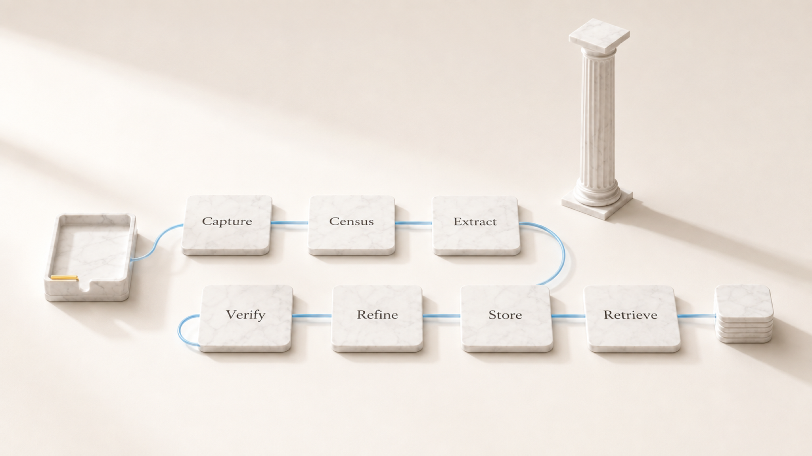

# Chat onboarding for Mnemazine

<p align="center">
  
</p>

<!-- owner-greeting:start -->

Hi, I’m Filipp Zarubin. I built Mnemazine because saved links, screenshots, PDFs, and voice notes are not knowledge until something reads them, checks them, and puts them where future work can find them.

This chat guide is for the first real run. I will explain each step before you do it, name what changes on disk, and leave choices where there is a real choice.

<!-- owner-greeting:end -->

## Step 1: Check the machine

**What I do:** I check Node.js, Python, git, npm, and whether this is macOS.

**Why:** Mnemazine uses local tools first. macOS gives local Apple Vision OCR; other systems still work, but screenshots may need a model or manual text.

**What changes on disk:** Nothing. This is read-only.

**What you get:** A clear list of what will work now and what needs setup.

**Fork:** If Node.js is missing, install it first. If only Apple Vision is missing, continue and process text/PDF/links first.

## Step 2: Pick the inbox

**What I do:** I choose the folder where you will drop raw material.

**Why:** One stable inbox prevents hidden piles. You should not need to remember five import paths.

**What changes on disk:** The inbox folder may be created, usually `~/Desktop/Mnemazine Inbox`.

**What you get:** One visible place for screenshots, PDFs, links, audio, and short notes.

## Step 3: Pick the knowledge vault

**What I do:** I connect Mnemazine to your markdown vault.

**Why:** The output is ordinary files, so you can read them in Obsidian, grep them, back them up, or move them later.

**What changes on disk:** The vault path is written to local config; the vault itself gets system notes and indexes.

**What you get:** A living knowledge base instead of another app silo.

**Fork:** Use an existing Obsidian vault, or let Mnemazine create a new folder and open it later.

## Step 4: Decide on deep mode

**What I do:** I ask whether model-assisted enrichment is allowed.

**Why:** Local mode is cheaper and private. Deep mode can research, split, and verify harder material, but text may go to the chosen model provider.

**What changes on disk:** Only the local setting changes. Existing notes are not rewritten by this choice.

**What you get:** A clear privacy/cost boundary before any material leaves the machine.

## Step 5: Run a small real batch

**What I do:** I process five to ten real files from your inbox.

**Why:** A demo proves almost nothing. Your own files show whether OCR, source tracking, atomization, and gates work.

**What changes on disk:** Final notes appear in the vault; processed sources move to the durable archive only after coverage is proved.

**What you get:** Searchable notes with sources, verification state, project links, and future project categories.

## Step 6: Verify the result

**What I do:** I run the doctor and quality gates.

**Why:** The run is not done until the machine proves no inbox file was silently dropped and the new notes follow the schema.

**What changes on disk:** Read-only checks may write reports or state receipts, but they do not edit your notes.

**What you get:** A pass/fail answer you can trust, plus named fixes if something is red.

```bash
npm run doctor
```
